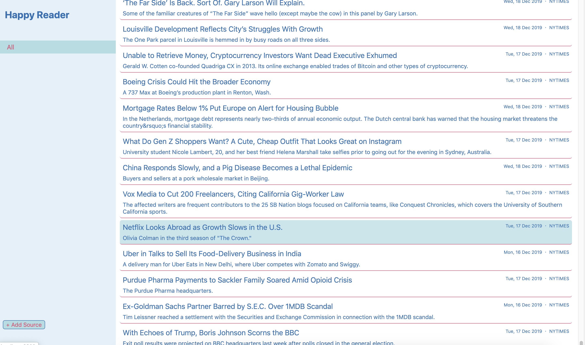

# RSS Reader

An RSS Reader built with React JS, Go, and MySQL.


## Running

Step 1: Clone the repo
```
$ git clone https://github.com/erjena/rss-reader.git
```

Step 2: Create database and tables
```
$ cd rss-reader
$ mysql -u root -p < schema.sql
```

Step 3: Build UI and start webpack
```
$ cd rss-reader/web
$ npm install
$ npm run react-dev
```

Step 4: Start the server
```
$ cd rss-reader
$ go build
$ go run rss-reader
```

## Usage

To add sources for your feed click `Add Source` button and paste the link into input window.

Simply click on a title and happy reading!

## Further Improvments

1. Allow users to choose between light and dark themes.